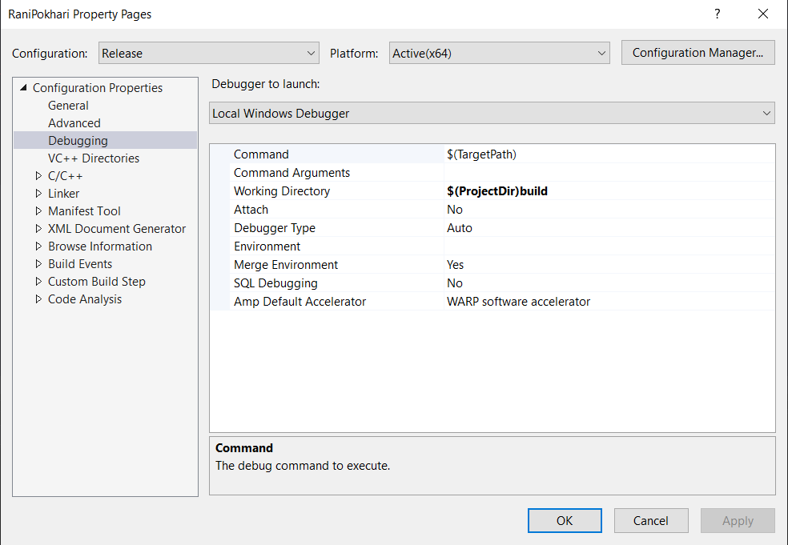
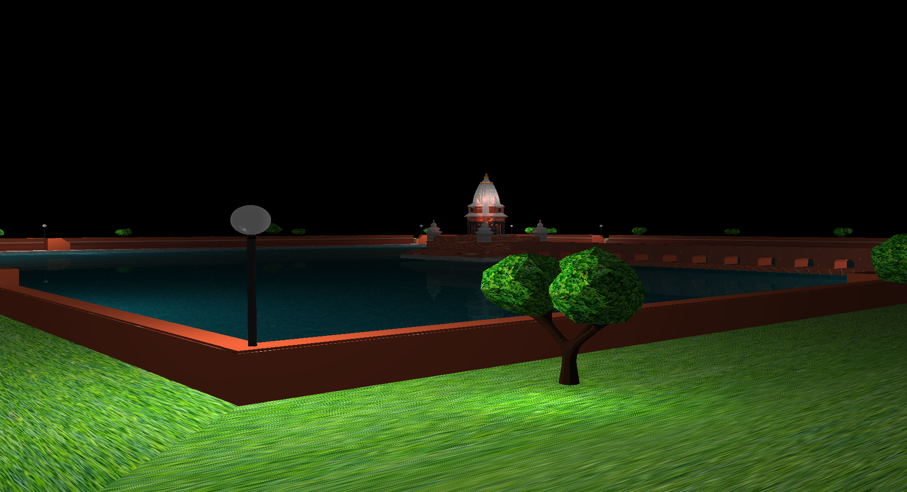

# Rani-Pokhari Modelling
This project is done as the fulfillment of requirements for completion of Computer Graphics course of Bachelor in Computer Engineering III year I part.

### System Requirements
-  Operating System : Linux/ Windows
-  Programming Language : C/C++
-  Graphics API : OpenGL 4.4
-  Library : GLFW, ASSIMP
-  OpenGL Loader: GLAD

### Build Process(Windows)

#### Visual Studio
- Set your working directory as ```$(ProjectDir)build``` 

- Build using visual studio in **Release** mode and run the exe in ```build``` directory

#### Command Line(Windows)
You either need to use ```x64 Command prompt for VS``` or need to install ```clang``` to build the project using command line.
- Navigate to the source directory from the command line 
- Run the ```build.bat``` file from the project directory


### Output


### Controls
```]```- increase the speed of keyboard  
```[```- decrease the speed of keyboard  
```n```- Night Mode  
```m```- Day mode

### Note
If you are using AMD GPU, you may have certain problems, so to use dedicated GPU please put the following code above ```main``` function.
```
extern "C"
{
	__declspec(dllexport) unsigned long NvOptimusEnablement = 0x00000001;
}
```
However if you integrated GPU is not AMD then you may not have any problems.


### Developers
[Sanskar Amgain](https://github.com/Imsanskar)  
[Sagar Timalsina](https://github.com/sgr45)  
[Sandip Puri](https://github.com/Sandippuri)  
